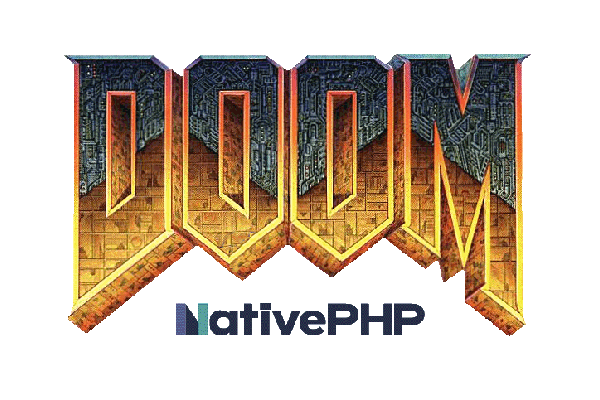

<p align="center"></p>

## About DOOM native PHP

DOOM native PHP is a  DOS game built on top of NativePHP.
This web application uses Laravel InertiaJS Vue3 Typescript Tailwindcss NativePHP, only.

It uses JS-DOS to emulate the DOS engine. And DOOM is hosted on a CDN.

I always wanted to play DOS games on my mac without the use of Steam or online platforms.
It was possible before, but now it is easy. It took me a day.

## Installation

1. Clone the repository on your local environment

```bash
git clone https://github.com/Itemshopp/doom-native-php.git
```


2. Install dependencies

```bash
composer install
npm install
```


3. Copy .env.example and generate key

```bash
cp .env.example .env
php artisan key:generate
```

``


4. Serve on electron

```bash
npm run dev [ open new terminal window ]
php artisan native:serve [ open new terminal window ]
```


5. Kill some Cacodemon

## Suggestions

- Add more games [ Prince of Persia, The secret of Monkey Island ]
- Change project name to PHP-DOS

Don’t hesitate to give us some feed backs and suggestions to improve the project on the github repository or on twitter : [Capsules Codes](https://twitter.com/capsulescodes)
